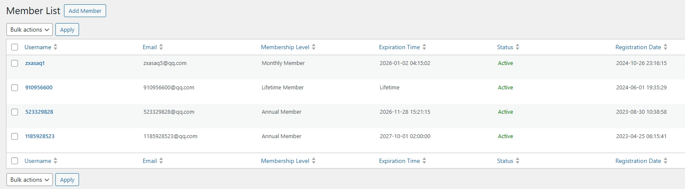
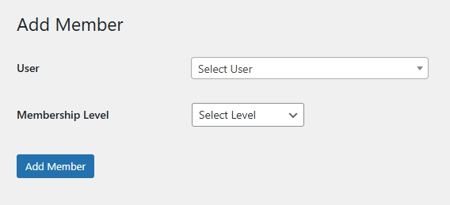
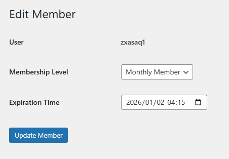
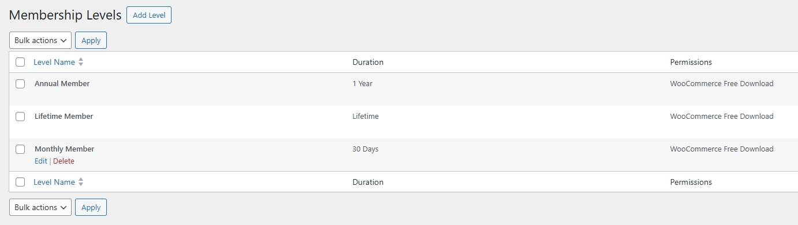
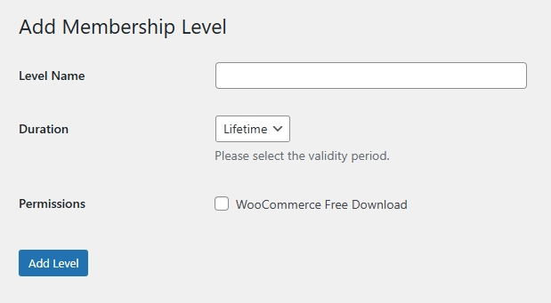
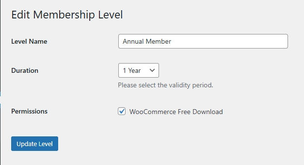

# Xenice Member – Easy-to-Use WordPress Membership Plugin

**Xenice Member** is a lightweight, flexible, and user-friendly WordPress membership management plugin that helps you easily create and manage membership levels, control content access, and deliver exclusive experiences to your users.

Whether you're running an online course platform, a private community, or a resource download site, Xenice Member gives you the tools to build a powerful membership system—without complexity.

---

## 🖼️ Screenshots

1. **Members Management**  
   

2. **Add Member**  
   

3. **Edit Member**  
   

4. **Membership Levels Management**  
   

5. **Add Membership Level**  
   

6. **Edit Membership Level**  
   

> 💡 Screenshots are located in the `/screenshots/` directory of this repository.

---

## ✨ Key Features

- **Flexible Membership Levels**  
  Create unlimited membership tiers (e.g., Monthly, Annual, Lifetime, or custom levels) with unique permissions.

- **Granular Permission Control**  
  Restrict access to posts, pages, downloads, or features based on membership level.

- **Intuitive Admin Dashboard**  
  Easily view, search, filter, and manage members. Perform bulk actions like editing expiration dates or deleting accounts.

- **WooCommerce Integration**  
  Offer members exclusive **free downloads** (single or multi-file) via direct links or popups—perfect for digital products.

- **Automatic Expiration & Status Tracking**  
  Set expiration dates and let the plugin automatically update member status (Active / Expired / Lifetime).

- **Multilingual Ready**  
  Fully compatible with WordPress multilingual plugins (e.g., WPML, Polylang) for global websites.

---

## 📦 Installation

1. **Download** the plugin ZIP file or clone this repository.
2. Upload the `xenice-member` folder to your `/wp-content/plugins/` directory.
3. Activate **Xenice Member** from your WordPress admin dashboard (`Plugins > Installed Plugins`).
4. Navigate to **Members** in your admin menu to start configuring membership levels and managing users.

> 💡 No external dependencies required. Works out of the box with any WordPress theme.

---

## 🎯 Ideal Use Cases

- Online education & course platforms  
- Private content or resource libraries  
- Employee-only intranet portals  
- Paid community or subscription sites  
- WooCommerce stores with member-exclusive downloads

---

## 🛠️ Development & Contribution

This plugin is open-source and welcomes contributions! Feel free to:

- Report bugs via [Issues](https://github.com/your-username/xenice-member/issues)
- Submit improvements via [Pull Requests](https://github.com/your-username/xenice-member/pulls)

> Replace `your-username` with your actual GitHub username.

---

## 📄 License

Xenice Member is licensed under the **GNU General Public License v3.0 (GPLv3)**.

---

## 🙌 About Xenice

Developed by [Xenice](https://xenice.com) — building simple, powerful tools for WordPress creators worldwide.

Made with ❤️ for the WordPress community.